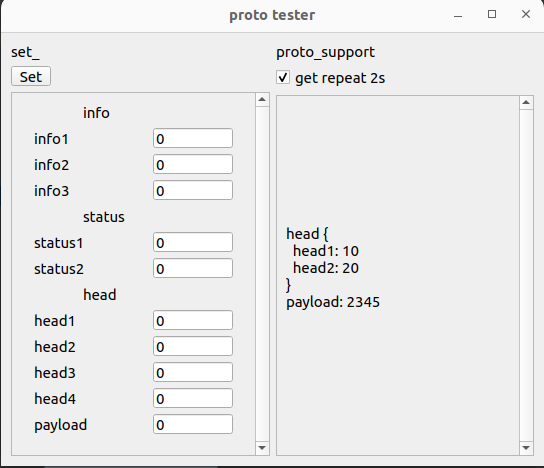

# proto demo ui
deps
```bash
$ poetry --version
Poetry (version 1.2.0)
$ protoc --version 
libprotoc 27.1
```
```bash
poetry install
```
Proto file [proto_app.proto](proto/proto_app.proto)

```bash
./generate.sh
```
```bash
poetry run demo-ui
```

emulation
```bash
./debug/run_virt_com.sh 
```
other terminal
```bash
poetry run python debug/emulation_proto.py 
```